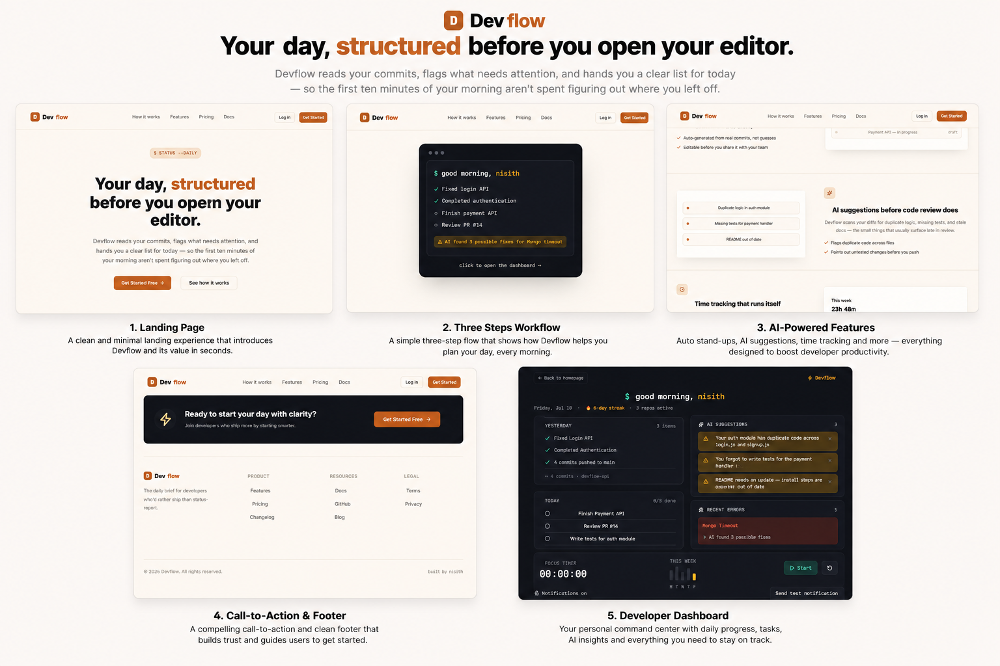

# 🚀 DevFlow

<p align="center">
  
</p>

<p align="center">
  <strong>Your day, structured before you open your editor.</strong>
</p>

<p align="center">
An AI-powered developer productivity platform that automatically organizes your workday, generates stand-up reports, tracks development progress, and provides actionable AI insights—all from one dashboard.
</p>

---

## 📖 About

Developers spend valuable time every day trying to remember:

- What did I finish yesterday?
- What should I work on today?
- Which pull requests are still pending?
- What issues require immediate attention?
- Which tasks are blocked?

DevFlow eliminates this friction by bringing commits, tasks, pull requests, AI suggestions, and productivity insights into one intelligent workspace.

---

## ✨ Features

### 📋 Smart Daily Dashboard

- Daily work summary
- Pending task overview
- Recent commits
- Project activity
- Morning briefing

---

### 🤖 AI Stand-up Generator

- Generate stand-up updates from Git commits
- Editable summaries
- Daily work reports
- Team-ready updates

---

### 🔗 Git Integration

- GitHub Integration
- GitLab Support
- Commit Tracking
- Pull Request Monitoring

---

### 🧠 AI Code Review

- Duplicate code detection
- Missing test suggestions
- Documentation reminders
- Smart development insights

---

### ⏱ Productivity Tracking

- Focus sessions
- Time tracking
- Weekly reports
- Productivity analytics

---

### 🔔 Smart Notifications

- Build failures
- Pending PR reminders
- AI suggestions
- Project alerts

---

## 🛠 Tech Stack

### Frontend

- React
- Vite
- React Router
- CSS3

### Backend

- Node.js
- Express.js

### Database

- MongoDB
- Mongoose

### Authentication

- JWT
- GitHub OAuth

### AI

- OpenAI API *(Planned)*

---

## 📂 Project Structure

```
DevFlow
│
├── assets
│   └── view.png
│
├── public
│
├── src
│   ├── assets
│   ├── components
│   ├── pages
│   ├── hooks
│   ├── layouts
│   └── App.jsx
│
├── package.json
└── README.md
```

---

## 🚀 Getting Started

### Clone the Repository

```bash
git clone https://github.com/your-username/DevFlow.git
```

### Navigate to Project

```bash
cd DevFlow
```

### Install Dependencies

```bash
npm install
```

### Start Development Server

```bash
npm run dev
```

Open your browser:

```
http://localhost:5173
```

---

## 🎯 Roadmap

- [x] Landing Page
- [ ] Authentication
- [ ] Dashboard
- [ ] GitHub Integration
- [ ] GitLab Integration
- [ ] Daily Stand-up Generator
- [ ] AI Code Review
- [ ] Task Management
- [ ] Productivity Analytics
- [ ] Notifications
- [ ] Team Collaboration

---

## 💡 Future Enhancements

- AI Sprint Planning
- AI Bug Detection
- Calendar Integration
- Slack Integration
- Discord Integration
- VS Code Extension
- Chrome Extension
- Mobile Application

---

## 🤝 Contributing

Contributions are welcome!

1. Fork the repository
2. Create a feature branch

```bash
git checkout -b feature-name
```

3. Commit your changes

```bash
git commit -m "Add new feature"
```

4. Push your branch

```bash
git push origin feature-name
```

5. Open a Pull Request

---

## 📄 License

This project is licensed under the MIT License.

---

## 👨‍💻 Author

**Nisith Bhowmik**

Built with ❤️ for developers.